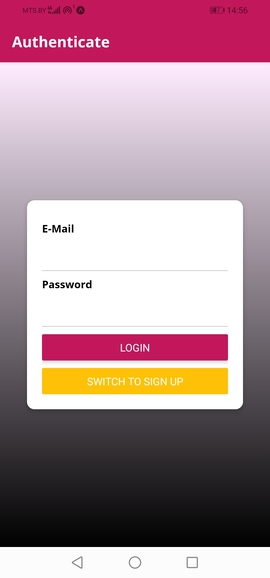

# shop app (React Native)

## Demo:

-   чтобы запустить приложение на телефоне отсканируйте QR-code с помощью приложения Expo Go:
    

### скриншоты приложения:

В данном приложении использовались:

-   react
-   react-redux
-   redux-thunk
-   react-native
-   react navigation 5
-   vector-icons
-   expo-app-loading
-   expo-font
-   expo-notifications
-   expo-permissions
